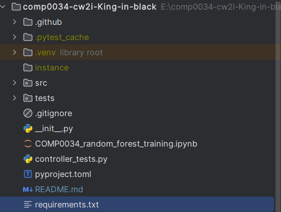
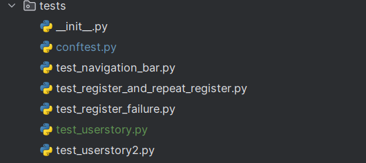
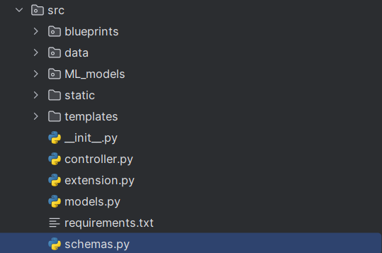

# COMP0034 2023/24 Coursework 2 starter repostitory
## Firstly, the arrangements of codes in file like this:

1. src means the source codes; containing detailed code 
2. tests directory containing all the tests file
3. COMP0034_random_forest_training.ipynb is the training program which trains random forest classification
4. controller_tests.py is the controller just use to be opened by tests function , which has a volatile database.

  

1.test_navigation.py bar tests the functions of navigation bar
2.test_login_failure.py tests the functions of login page and test extreme tests when user name is worng 3.
3.test_register_failure.py tests the functions of registers and test extreme tests when register fails
(exsiting users register again)
4.test_userstory.py and test_userstory2.py tests 2 user stories of complete process which a user try to register
,log in , predict activity state by typing data. 

If you want to connect to exsiting to SQLlite database and run the webapp; Switch you work directory to
comp0034-cw2i-King-in-black\src and then run the code:
`flask --app controller  run --debug`
1.Webapps' code locates in bp_webpage.py in blueprints
2 Other blueprints are parts in REST.api
3 Related HTML is in static files

